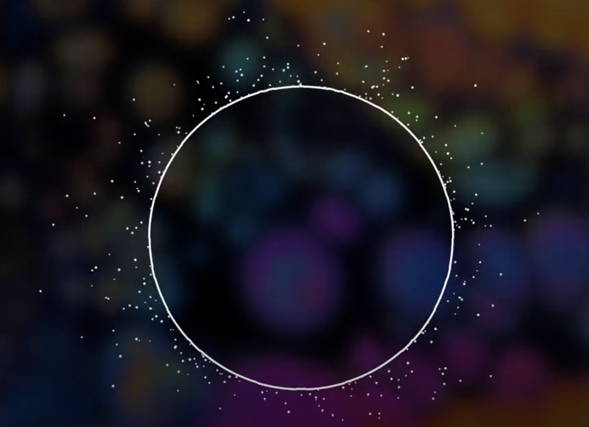

# jguo0782_9103_tut4 Group_E Individual Work
### Jingying Guo SID:530759207
1. [Interaction Method](#interaction-method)
2. [Design Inspiration and Concept](#design-inspiration-and-concept)
3. [Change to the Group Code](#change-to-the-group-code)
    1. [Steps from Group Work to Individual Work](#steps-from-group-work-to-individual-work)
5. [Reference](#reference)
    1. [Individual Code Reference](#individual-code-reference)
    2. [AI Using](#ai-using)
    3. [Other Unit Study](#other-unit-study)
## Interation Method
After opening the HTML file, click the **play** button in the **top left corner**. to experience an abstract 3D cityscape animated in sync with the CityPOP track "Plastic Love," using FFT analysis of the audio signal.
You can adjust the volume with the slider to control sound levels, and the Play/Pause button controls both the music and the animation. The track is set to loop, so music will automatically restart upon completion.    
The camera angle can be adjusted by dragging with the mouse, allowing you to explore the cityscape from different perspectives.  
### Design Inspiration and Concept
The inspiration is comes from modern city and nostalgic culture from recent year‘s internet, combine with audio interation with particle from youtube.  

The four main elements each respond to the track in unique ways, creating an abstract cityscape where particles represent moving crowds, vertical lines suggest building outlines, plates and spaces between plates form streets and districts, and boxes symbolize urban vibrancy. CityPOP, a genre popular in the 1980s, reflects urban life and emotions, aligning with Mondrian's Broadway-inspired depiction of city streets.  
  
With a rich distribution of low, mid, and high frequencies, CityPOP music provides a layered animation through FFT analysis, generating diverse visual responses in each element. Initial attempts to map every element to FFT data proved overwhelming, so selective elements like vertical lines and random boxes, are tied to frequency, while others like plates and particles, are timed to the track by audio.  
  
### Change to the Group Code
* Audio Player and Analysis:
  Introduced audio and FFT variables in the preload function to load and analyze the audio file, enabling looped playback via p5.js.  

* Color Sequence and Change Interval:
  Added `colorSequence` and `colorChangeInterval` attributes in the `Scene class`, defining a set of colors and a 2000ms interval for dynamic color transitions.  

* Audio Control Parameters:
  Included an audioParams object, with parameters like `minScale`, `maxScale`, `boxMinScale`, and `boxMaxScale`, for fine-tuning visual responses to audio.  

* Particle Effect Configuration:
  Added `particleConfig` object to the `class Scene`, setting base radius, offset position, dispersion speed, and variation for dynamic particle effects.  

* Dynamic Color and Size Change:
  Integrated color-changing logic into `initializePlates` where each plate has `colorIndex`, `lastColorChange`, `colorSequence`, and `colorChangeInterval`, enabling timed color shifts. Each randomly generated plate retains its original size for frequency-based resizing.
#### Steps from Group Work to Individual Work
**Added audio functionality by loading an audio file and initializing FFT in preload, enabling scene-audio interactivity.**
* Implemented a `class Particles` to introduce new visual elements.
* Designed FFT-based animations for selective elements like vertical lines and random boxes, while others respond to elapsed time to balance aesthetics.
* Camera Adjustment: Repositioned the `camera` for a vertical perspective, making the vertical lines resemble building contours, with FFT-affected elements more visible.
* FFT Mapping for `verticalLine` and `RandomBoxes`.  
* Added a Play/Pause button to toggle the playback mode, allowing users to control the animation and music synchronization.  
* Included a volume slider to adjust the audio volume, providing users with control over the sound levels in the interactive experience.  
### Reference
#### Individual Code Reference
* [Particle with music tutorial from Youtube](https://www.youtube.com/watch?v=uk96O7N1Yo0)  
* [3D in WEGBL from Youtube](https://www.youtube.com/watch?v=nqiKWXUX-o8)  
* [Volume Slider reference](https://editor.p5js.org/jfforero/sketches/FYr5O5bAx)  
* [Map method used scale values from one range to another](https://p5js.org/zh-Hans/reference/p5/map/)
* [Use floor() to avoid decimal number](https://p5js.org/zh-Hans/reference/p5/floor/)  
* [Use millis to returns the number of milliseconds.](https://p5js.org/zh-Hans/reference/p5/millis/)  
#### AI USing
 Used AI to modify the range of mouse control in orbitControl to prevent the screen from moving with the mouse when adjusting the volume slider. In the setup function, learned and modified the part where 
 `volumeSlider.elt.addEventListener` in `setup()` is used with the help of ChatGPT.
#### Other Unit Study
The `colorIndex` method was inspired by the Python `list.index()` method that I learned this semester. In Python, the `list.index()` method returns the index of the first occurrence of an element in a list. Similarly, in the Individual work code, the `indexOf()` method performs a similar operation: it returns the position of `config.color` in the `colorSequence` array, allowing for the reading of the color sequence and executing the color transformation over time. The index is used to track the current position in the color sequence, then used in the updateColor method to cycle through colors.  

For handing error, if the color is not found `(indexOf() returns -1)`, it defaults to 0.

## Thanks for reading! Enjoy music :musical_note: