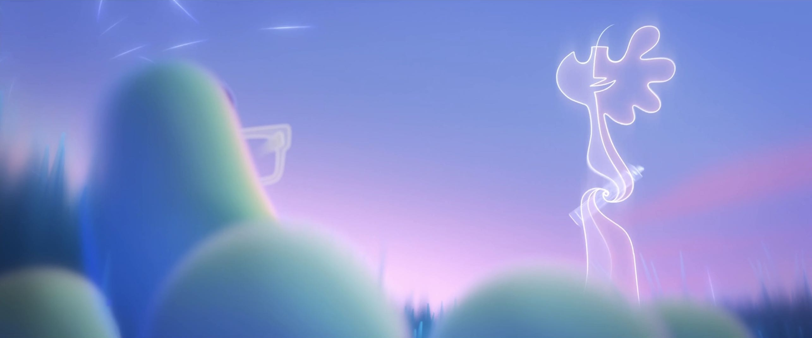
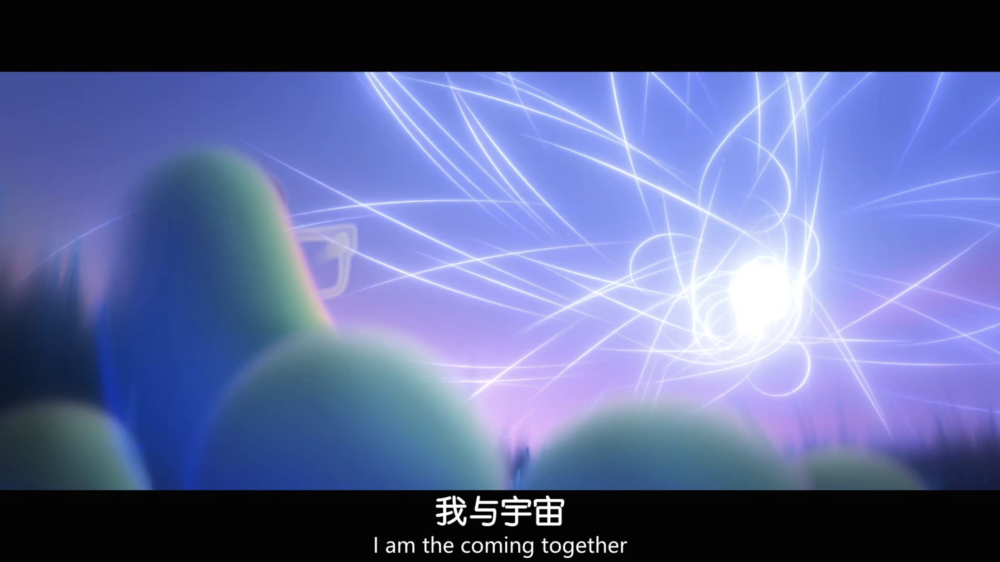
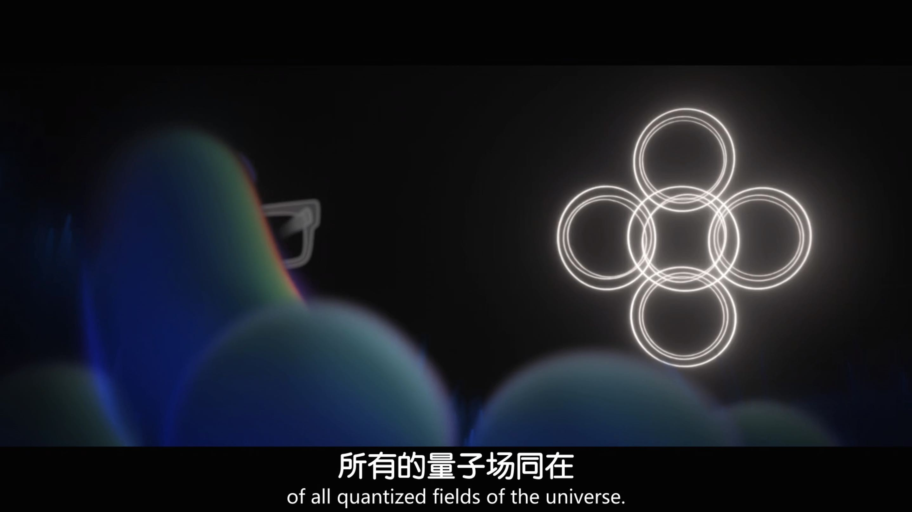
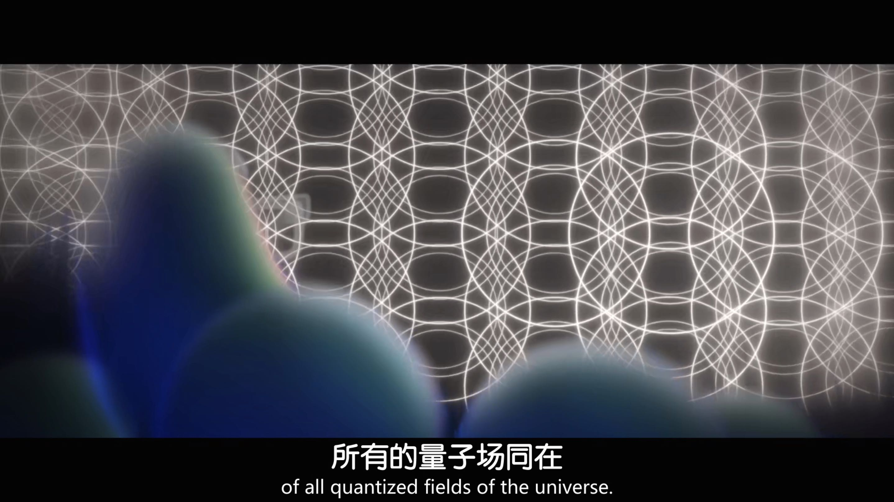
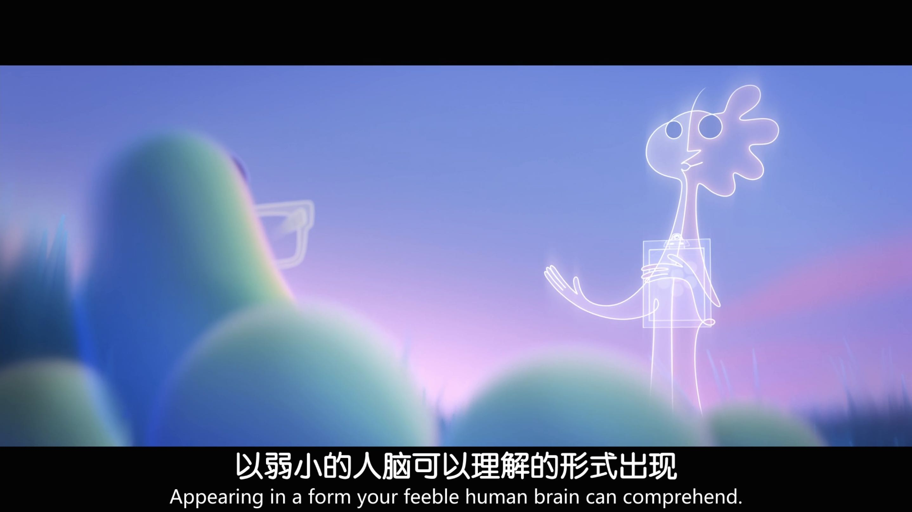

# jguo0782_9103_tut4
Week 8 quiz for Main Group Work
## Part1:cloud:
#### I hope to incorporate lines into my own work. The character design of Jerry in Soul also uses Picasso’s visual style of line drawing. By following the trajectory of lines, batches of circles are generated, which then expand further to create more circles, eventually returning to the lines themselves. The assignment provides Picasso’s dove as a reference image. I believe that the useful techniques required by the assignment can be achieved by combining the movement of lines and particles, thereby bringing an interactive visual effect to the work.

[link test](https://dribbble.com/search/p5js)

