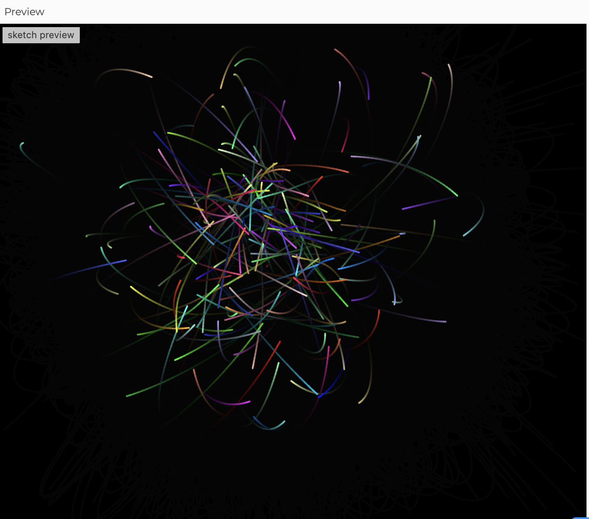

# jguo0782_9103_tut4 Project
## Week 8 quiz for Main Group Work Prepare
- [Part 1: Imaging Technique Inspiration](#part1-imaging-technique-inspiration)
- [Part 2: Coding Technique Exploration](#part2-coding-technique-exploration)
---
### Part1: Imaging Technique Inspiration
:cloud:  
I hope to use the line elements of the following work as a source of inspiration.   
The design of charater Jerry in the movie Soul was inspired by Picasso’s line elements. In the film, the solid lines transform into particle motion and eventually return to their original line forms.   
I believe that by combining the effects of line and particle motion, it is possible to achieve the necessary techniques for the task, thereby bringing an interactive experience and creative visual effects to the work.
 #### Film Screenshots: 

### Part2: Coding Technique Exploration
:ocean:
This coding effect allows particles to be attracted based on clicks, with each click controlling the range of particle movement.  
It displays countless particles drawn into motion, following specific trajectories that form lines.  
I believe that by controlling particle movement through click-based attraction, it is possible to achieve the desired line motion outlined in the first part.  
Additionally, to achieve the desired effect, it is necessary to modify the color of the particles and restrict the clickable area.  
#### Code Link
[Code_Particle attractors](https://editor.p5js.org/CarolinaPhoenix/sketches/df870Z9-q)
#### CodeScreenshot

